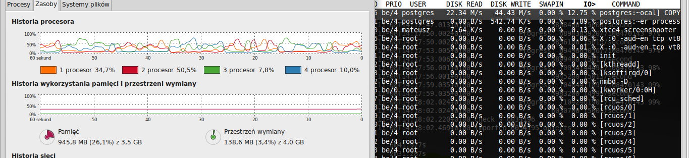

```
Sprzęt: 
Laptop ACER ASPIRE ONE 5820TG
Procesor: Intel core I5-430M
Ilość pamięci RAM: 4 GB
Dysk twardy: SSD SanDisk 128 GB
System Operacyjny: Linux Mint 17 x64
Wersja MongoDB: 2.6.5 oraz 2.8.0.rc0
Wersja PostgreSQL: 9.3.5
```

#### Wstęp: Przetworzenie danych Train.csv

1. Do rozpakowania pliku Train.zip użyłem programu **pigz**, który rozpakowuje plik wykorzystując wszystkie rdzenie procesora.

2. Ponieważ plik Train.csv nie jest typowym plikiem .csv, gdyż rekordy nie są przechowywane w jednej linii, musimy pozbyć się znaków nowej linii. Ponadto, ponieważ jest to plik w systemie DOS, to musimy zastąpić znaki powrotu karetki na znaki nowej linii. Dokonujemy to poleceniem: 

```
tr -d "\n" < input_file | tr "\r" "\n" > output_file
```

Powyższe polecenie wykorzystuje wyłącznie dwa rdzenie procesora.

3. Ponieważ plik Train.csv zawiera unikatowe pole id, to aby nie powielać tych danych w bazie usuniemy ją z pliku. 

Czasy wykonania etapów przedstawiłem w poniższej tabelce:

|Etap|Czas wykonania|
|-----|-------------|
|Rozpakowanie pliku| 5 m |
|Zamiana formatu danych| 5 m|

### Zadanie 1a: Zaimportuj bazę danych do PostgresSQL oraz MongoDB.

Do zaimportowania danych w postgreSQL użyłem polecenia: 

```
COPY from <nazwa_tabeli> 'sciezka_do_pliku' 
```
Zaś do zaimportowania danych do MongoDB polecenia 

```
mongoimport -d <database> -c <collection> --type csv --file <file_name> --headerline --drop --stopOnError
```

Jeżeli chodzi o MongoDB wiredtiger to należy uruchomić bazę następującym poleceniem: 

```
./mongod --storageEngine wiredtiger --dbpath <sciezka_do_bazy>
```

Jednak w przypadku całej bazy **Train.csv** wiredtiger wywala następujący błąd:


Dlatego zostałem zmuszony do zaimportowania wyłącznie kolumny **Tags** za pomocą wiredtiger.

Jednak zauważyć można dziwne zachowanie procesora przy **wiredtiger**


Wyniki zaimportowanych danych są przedstawione w następującej tabeli: 

|Postgres| MongoDB| MongoDB wiredtiger|
|--------|--------|-------------------|
|6.10 m|6.42 m|8.47m|
|16487 rekordów|15665 rekordów| - |

Wykres dla PostgresSQL



Wykres dla MongoDB


##### Wnioski:

- Większe wykorzystanie procesora możemy zaobserwować podczas importowania danych w MongoDB.

- Szybkie czasy spowodowane są użyciem dyskiem SSD.

- Wyłączenie wypisywania potwierdzenia dodania rekordów do bazy 
MongoDB nie zmieniło czasu importowania danych.

- PostgreSQL ma mniejsze wykorzystanie procesora niż w MongoDB w wersji 2.6.5

### Zadanie 1b: Zliczenie wszystkich rekordów z bazy.

W obu przypadkach otrzymałem poprawną odpowiedź czyli **6034195**.
Ponadto zmierzyłem czasy zapytań w obu przypadkach.
Wyniki prezentuje poniższa tabelka: 

|Rodzaj zapytania |Czas wykonania w PostgreSQL |Czas wykonania w MongoDB | 
|-----------------|----------------------------|-------------------------|
|Zliczenie rekordów(count) |19.97 s | 0 s | 
|Wyszukanie rekordu o danym id (select) | 19.85 s| 46.4 s |

#### Wnioski: 

- MongoDB świetnie i szybko sobie radzi z obliczeniami na bazie danych, używając funkcji agregujących.
- Jeżeli chodzi o wyszukanie rekordu w którym musimy przejrzeć całą bazę to PostgreSQL lepiej poradził sobie z tym zadaniem.

### Zadanie 1c: Zamiana formatu danych

Przed wykonaniem tego zadania, wiedząc że nie będę wogóle korzystał z kolumn o nazwach: "Title","Body" postanowiłem usunąć je z pliku Train.csv.

Można to zrobić przy pomocy prostego narzędzia: cut.
Jednak ja wykorzystałem polecenie. 

```
mongoexport -d test -c database --csv -f "Tags" -o export.csv

```
Okazało się, że mongoexport jest **jednowątkowy** a jego czas wynosi w naszej bazie **4m 55s**.

#### Przypadek 1: Zamiana formatu danych bez użycia baz danych

W tym przypadku użyjemy pakietu R.
W pierwszym przypadku załadowaliśmy plik z danymi do R i jednowątkowo go obrobiliśmy.
W drugim przypadku robimy to samo ale z użyciem wątków.
Wykonują to skrypty: **Script1.R** oraz **Script2.R**

W **Script1.R** użyłem pakietu **ff**, która służy do oszczędniejszego przechowywania danych w pamięci operacyjnej. Następnie wykonuje się prostą funkcję **strsplit**. W przypadku 1 każdy rekord jest obrabiany przez jeden wątek.

W **Script2.R** również używam pakietu **ff** oraz **parallel**, który pozwala mi wywoływać pętle typu **apply,sapply,lapply** równolegle wykonując następujące polecenie: 

```
mclapply(correctData,replaceString,mc.cores = a
```

gdzie **correctData** to nasze dane, **replaceString** to nasza funkcja obrabiająca dane a **mc.cores** to ilość rdzeni jakie chcemy użyć.

#### Przypadek 2: Zamiana formatu danych przy użyciu MongoDB i sterownika

Użyłem tutaj pakietu R oraz paczki rmongodb.
Jednak że przekształcenie w tym przypadku jest jednowątkowe. Spowodowane jest to przechodzeniem przez cursor. Jednak tutaj przestawia on elementy w bazie.
Wykonuje to skrypt: Script3.R
Podczas przechodzenia przez cursor jaki otrzymamy z find() program wyciąga dane za pomocą polecenia:

```
mongo.bson.value(<cursor>)
```

Następnie dokonuje split na otrzymanych danych, a potem tworzy obiekt **BSON** i robi update w bazie.

```
        buf = mongo.bson.buffer.create()
                  mongo.bson.buffer.append(buf,"_id",tmp[[1]])
                  mongo.bson.buffer.append(buf,"Tags",l)
                  objNew = mongo.bson.from.buffer(buf)
                  mongo.update(mongo,coll,mongo.cursor.value(testData),objNew,mongo.update.upsert)  
```

#### Przypadek 3: Zamiana formatu danych przy użyciu konsoli MongoDB

Tutaj zastosowałem przypadek pojedyńczego wrzucania elementu oraz wrzucania naraz 10000 danych.
Wykonuje to program: mongoOne.js oraz mongoMany.js

#### Przypadek 4: Zamiana formatu danych przy użyciu PostgreSQL i sterownika

W tym przypadku nie udało mi się połączyć R z postgreSQL związana z jej konfiguracją.
Jednak procedura była by podobna jak w przypadku 2.

Czasy z każdego z przypadków przedstawiłem w poniższej tabelce: 

|Nazwa przypadku |Czas wykonania|Czas wykonania - MongoDB 2.8.0.rc0|
|----------------|--------------|-------------------------------|
|Przypadek 1| 1 wątkowo: 4m 51s ; 4 wątkowo: 4m 38s| - |
|Przypadek 2| 67m 4s| 77m29.753s | 
|Przypadek 3| Pojedyńczy insert: 71m 52s; Paczka insertów: 10m 43s|Paczka insertów: 17m54.548s |
|Przypadek 4| Czas zbliżony do przypadku 2 | - |

WNIOSKI:

- Wrzucanie pojedyńczo elementów jest o wiele wolniejsze niż wykorzystanie batch.insert.
- 2 przypadek był o wiele wolniejszy od 1, ponieważ mamy tutaj komunikację skryptu z bazą MongoDB. W 1 przypadku robimy to mając dane w pamięci operacyjnej.
- MongoDB wiredtiger wolniej działa obecnie niż MongoDB 2.6.5.

###Kompresja danych w MongoDB

Poniższa tabelka przedstawia rozmiary baz jakie były w przypadku bazy zawierającej wyłącznie Tagi z zadania 1.

|Mongo 2.6.5|Mongo 2.8.0.rc0 wiredtiger MMAP|Mongo 2.8.0.rc0 wiredtiger ZLIB|
|-----------|-------------------------------|-------------------------------|
|552.597MB | 810.931MB| 331.618MB|


###Zadanie 1d: Geojsony w MongoDB

####Przygotowanie danych

Wygenerowałem parę punktów z danymi poprzez stronę geojson.io.
Punkty te reprezentują miejsca, które odwiedziłem lub, które mam zamiar zwiedzić.

Ogólna postać pliku: 

```
{
      "geometry": {
        "coordinates": [
          15.14533996582031,
          51.084978552372114
        ],
        "type": "Point",
        "_id": "Wisień Dolny"
      },
      "properties": null,
      "type": "Feature"
    },
    {
      "geometry": {
        "coordinates": [
          14.650268554687498,
          52.5846946835471
        ],
        "type": "Point",
        "_id": "Kosztrzyn"
      },
      "properties": null,
      "type": "Feature"
    }

```

Ogólny widok na mapę: 


[Mapa na githubie](https://github.com/miotek32/NoSQL/blob/master/geojson/printAll.geojson)

####Wrzucenie danych do MongoDB

Otrzymane dane musiałem zamienić na format **.json**. Wykorzystałem do tego program **jq**. Poza tym każdy obiekt json w pliku musi być w jednej linii. Obrobione dane wyglądają następująco: 

```
{"loc":{"type":"Point","coordinates":[18.36639404296875,54.345551066642514]},"_id":"Żukowo"}
{"loc":{"type":"Point","coordinates":[18.29395294189453,54.32112902142024]},"_id":"Borowo"}
{"loc":{"type":"Point","coordinates":[18.22734832763672,54.29228433409048]},"_id":"Kiełpino"}
{"loc":{"type":"Point","coordinates":[18.174133300781246,54.265224078605655]},"_id":"Goręczyno"}
```

Następnie stworzyłem kolekcję myPlaces w MongoDB wykorzystując polecenie:

```
mongoimport -d "test" -c "myPlaces" < myPlaces.json
```

Następnie dodałem indeks do moich danych poleceniem:

```
db.myPlaces.ensureIndex({"loc" : "2dsphere"})
```

Zapytania będą wykorzystywać powyższe dane i robić z niego różne obiekty **.geojson**

####Zapytania 

Wszystkie zapytania są w folderze **geojson_scripts**.
Po wywołaniu funkcji z folderu **geojson_scripts** należy rezultat przepuścić przez skrypt **convert.bash**, który zamienia rezultat na plik **.geojson**.

1. Wywołanie punktu oraz punktów sąsiednich o 7 km: **point.js**.

```
var findPlace = db.myPlaces.find({"_id":"Kiełpino"}).limit(1).toArray()[0];
var points = db.myPlaces.find( {loc: { $near : { $geometry: { type: "Point",  coordinates: findPlace.loc.coordinates }, $maxDistance: 7000  } } } );
```

Punkty te są dodatkowo przetwarzane w różne kolory, figury itd.

MAPA:


[Mapa na githubie](https://github.com/miotek32/NoSQL/blob/master/geojson/point.geojson)

2.Narysowanie linii z punktu do punktu: **lineString.js**.

Linia ma zmieniony kolor na zielony oraz zwiększoną grubość.

```
var start = db.myPlaces.find({_id:"Chojnice"}).limit(1).toArray()[0];
var end = db.myPlaces.find({_id:"Kiełpino"}).limit(1).toArray()[0];

var properties = {"name":"LineString","stroke":"#55AA22","stroke-width":5}

var line = {"_id":"String","properties":properties, "loc": {"type": "LineString", "coordinates":[start.loc.coordinates,end.loc.coordinates]}};

```


[Mapa na githubie](https://github.com/miotek32/NoSQL/blob/master/geojson/lineString.geojson)

3. Narysowanie linii mające wiele punktów od miejsa w kole: **multiLineString.js**.

```
var start = db.myPlaces.find({"_id":"Kosztrzyn"}).limit(1).toArray()[0];
var cursor = db.myPlaces.find({loc: { $geoWithin: { $center: [ [15.51,51.01],1 ]}}});
...
var result = [{"_id":{}, "properties": {}, "loc": {"type": "MultiLineString", "coordinates":[table]}}];

```

MAPA: 


[Mapa na githubie](https://github.com/miotek32/NoSQL/blob/master/geojson/multiLineString.geojson)

4. Narysowanie punktów jako wielokąt w okręgu: **circle.js**.

```
var points = db.myPlaces.find( {loc: {$within: {$centerSphere: [[18.12,54.34],0.01]} } } );
...
```


[Mapa na githubie](https://github.com/miotek32/NoSQL/blob/master/geojson/polygon.geojson)

5. Narysowanie punktów wykorzystując różne style w danym wielokącie: **pointProperties.js**.

```
var query = db.myPlaces.find( { loc: {$geoWithin: {$geometry: {type:"Polygon",coordinates: [
[ [18.36,54.34], [18.12,54.34], [18.17,54.26], [18.36,54.34]  ]] } } } });
...
```


[Mapa na githubie](https://github.com/miotek32/NoSQL/blob/master/geojson/pointProperties.geojson)

6. Narysowanie wszystkich elementów w jednym między danymi punktami: **AllElements.js**.

```
var start = db.myPlaces.find({_id:"Lubań"}).limit(1).toArray()[0];
var end = db.myPlaces.find({_id:"Lubomierz"}).limit(1).toArray()[0];
var points = db.myPlaces.find( {loc: {$nearSphere: {$geometry: {type: "Point", coordinates: start.loc.coordinates },$maxDistance:50000}}} );
...
```


[Mapa na githubie](https://github.com/miotek32/NoSQL/blob/master/geojson/allElements.geojson)


Statystyki:

```
{
  "ns": "test.database",
  "count": 6034195,
  "size": 468986577,
  "avgObjSize": 77,
  "storageSize": 263036928,
  "nindexes": 1,
  "capped": false,
  "wiredtiger": {
    "uri": "statistics:table:collection-0--7287416412610174084",
    "LSM": {
      "bloom filters in the LSM tree": 0,
      "bloom filter false positives": 0,
      "bloom filter hits": 0,
      "bloom filter misses": 0,
      "bloom filter pages evicted from cache": 0,
      "bloom filter pages read into cache": 0,
      "total size of bloom filters": 0,
      "sleep for LSM checkpoint throttle": 0,
      "chunks in the LSM tree": 0,
      "highest merge generation in the LSM tree": 0,
      "queries that could have benefited from a Bloom filter that did not exist": 0,
      "sleep for LSM merge throttle": 0
    },

...

```
